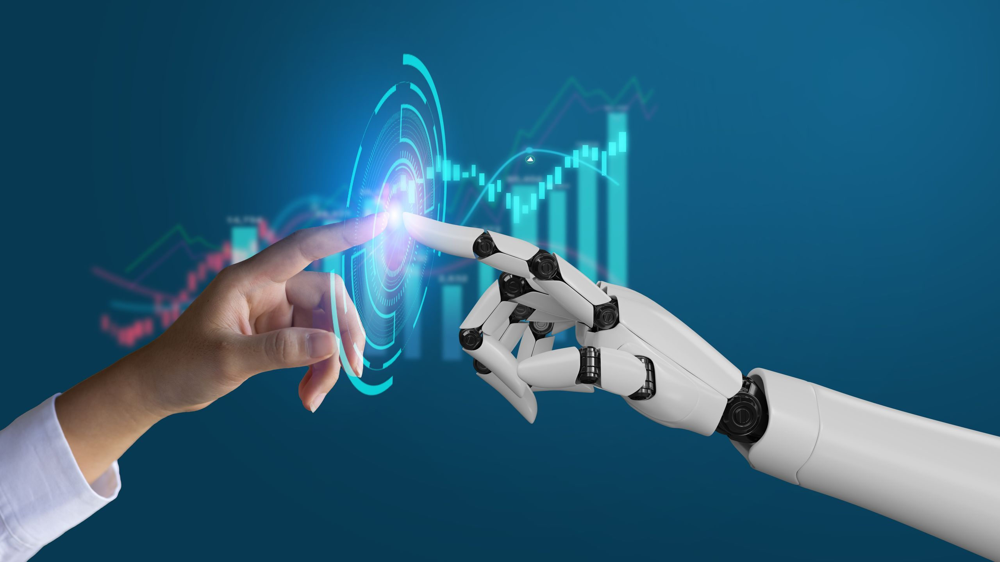

# Influencia de las IAs en el aprendizaje humano.
## Las IAs nos favorecen dentro del mundo del estudio. 
La __inteligencia artificial__ se ha convertido en una herramienta clave en los procesos educativos, modificando la manera en que las personas adquieren y aplican el conocimiento. Su mayor aporte es la posibilidad de personalizar el aprendizaje: los sistemas basados en IA analizan el desempeño de cada estudiante y adaptan el contenido a su ritmo y necesidades, lo que fomenta un progreso más individualizado y eficaz.

Otra ventaja es la retroalimentación inmediata, que ayuda a corregir errores en tiempo real y promueve un aprendizaje más activo. Además, herramientas como traductores automáticos o asistentes virtuales han hecho que el conocimiento sea más accesible, superando barreras de idioma y contexto.

Sin embargo, esta influencia no está exenta de riesgos. Una dependencia excesiva de la IA puede generar aprendizaje superficial y reducir la capacidad de razonamiento autónomo. También es necesario considerar los sesgos de los datos con los que estas tecnologías son entrenadas, ya que pueden reproducir desigualdades.

En conclusión, la IA ofrece grandes oportunidades para mejorar y democratizar la educación, siempre que se utilice como un complemento que potencie el pensamiento crítico y la creatividad, en lugar de reemplazarlos. :grin:
### Ventajas y desventajas:
#### Ventajas:
:white_check_mark: Aprendizaje personalizado: Adapta el contenido y el ritmo según las necesidades de cada estudiante.

:white_check_mark: Retroalimentación inmediata: Permite corregir errores y mejorar habilidades en tiempo real.
#### Desventajas:

:x: Dependencia tecnológica: Puede limitar la autonomía y el pensamiento crítico si se usa en exceso.

:x: Sesgos en los datos: Los algoritmos pueden reflejar prejuicios presentes en los datos con los que fueron entrenados.

[Pagina de interés](https://www.incibe.es/menores/blog/el-uso-de-la-inteligencia-artificial-en-el-entorno-educativo)